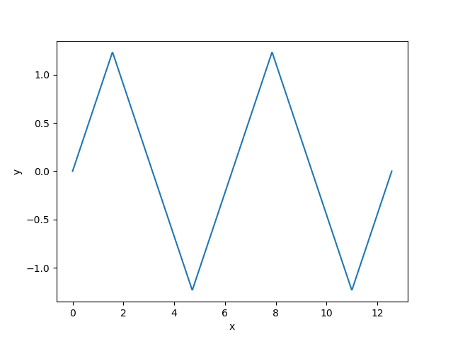
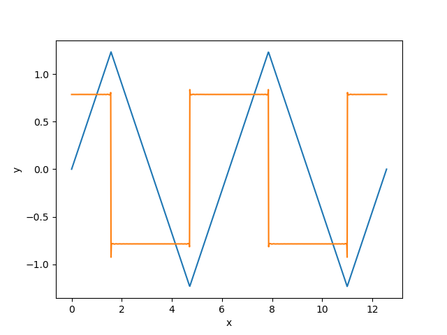

# CuDiff.jl

**CuDiff** adds forward auto-differentiation capability using [dual numbers](https://en.wikipedia.org/wiki/Dual_number) to GPU kernels and is a bridge between the [JuliaGPU](https://github.com/juliagpu) and [JuliaDiff](https://github.com/juliadiff) ecosystems.

[Automatic Differentiation](https://en.wikipedia.org/wiki/Automatic_differentiation) has many applications in numerical computation, including solving ordinary differential equations, optimization, and machine learning. **JuliaDiff** is a powerful set of routines for auto-differentiation, including those that calculate gradients, jacobians and hessians, but unfortunately does not work with **JuliaGPU**.

**CuDiff** provides only a limited subset of **JuliaDiff** functionality, namely the simple scalar forward differentiation. However, even this limited capability can be very useful when combined with the power of the GPU computation.

# Usage

**CuDiff** exports only one function: *derivative(f,x,...)* and works similar to *ForwardDiff.derivative*. Here, *f* is a GPU compatible function with one or more inputs. *derivative* returns a tuple *f(x,...), f'(x,...)*, where the differentiation is with respect to *x*, i.e., the first argument of *f*.  

Let's look at an example. We define a GPU function that calculates a triangular waveform using the Fourier series:

```julia
using CUDAnative

function triangle_series(x)
    series_sum = 0f0

    for k = 1000:-1:1
        n = 2*k-1
        series_sum += (k & 1 == 1 ? +1f0 : -1f0) * CUDAnative.sin(n*x) / (n*n)
    end

    return series_sum
end
```

We can call this function by setting up the input and output CuArrays and invoking a GPU kernel that convert the arrays into scalar calls:

```julia
import PyPlot; plt = PyPlot;
using CuArrays

function kernel(x, y)
    i = (blockIdx().x-1) * blockDim().x + threadIdx().x
    y[i] = triangle_series(x[i])
    return nothing
end

x = range(0, 4*pi, length=1024)
y = similar(x)
d_x = CuArray(x)
d_y = CuArray(x)

CUDAnative.@cuda threads=1024 kernel(d_x, d_y)

copy!(y, d_y)
plt.plot(x, y)
```

Assuming the GPU, CUDA drivers and SDK are all correctly set up, the result is



Now, let's differentiate! We change the main kernel to

```julia
function kernel_deriv(x, y, dy)
    i = (blockIdx().x-1) * blockDim().x + threadIdx().x
    y[i], dy[i] = CuDiff.derivative(triangle_series, x[i])
    return nothing
end
```

The main difference is that now the kernel does not call *triangle_series* directly. Instead, it calls *CuDiff.derivative* passing *triangle_series* as the first argument. The rest of the code is modified with the addition of a placeholder for the derivative (*dy*):

```julia
x = range(0, 4*pi, length=1024)
y = similar(x)
dy = similar(x)
d_x = CuArray(x)
d_y = CuArray(x)
d_dy = CuArray(x)

CUDAnative.@cuda threads=1024 kernel_deriv(d_x, d_y, d_dy)

copy!(y, d_y)
copy!(y, d_dy)
plt.plot(x, y)
plt.plot(x, dy)
```

As expected, the result - which also exhibits Gibb's phenomenon - is



*derivate* accepts more than two arguments. These additional arguments are passed unchanged. If a function has more than one parameter, say *f(x, y, z)*, we can  differentiate with respect to a *y* or *z* by using an anonymous function. For example, the follow code allows us to differentiate *f* with respect to *y*:

```julia
df_dy = derivate((y,x,z)->f(x,y,z), y, x, z)
```
